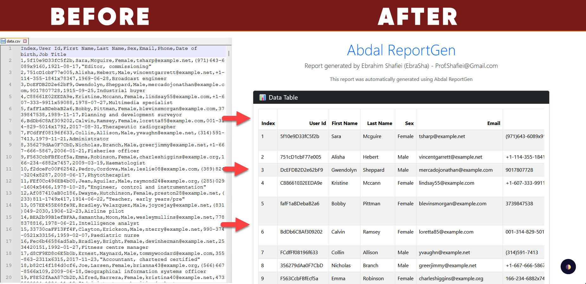

# 📊 ابدال ریپورت‌جن (Abdal ReportGen)

<p align="center">
  
</p>

[🇬🇧 English Documentation](README.md)

## 📋 معرفی
ابدال ریپورت‌جن یک ابزار قدرتمند تولید گزارش HTML چند فرمتی است که توسط ابراهیم شفیعی (EbraSha) توسعه یافته است. این نرم‌افزار به شما امکان می‌دهد به راحتی فرمت‌های مختلف فایل‌های داده را به گزارش‌های HTML با استایل زیبا و ویژگی‌های مدرن تبدیل کنید.

## ✨ ویژگی‌ها
- **🔄 پشتیبانی از چند فرمت**: پردازش داده‌ها از فایل‌های CSV، JSON، XML، Excel و SQL
- **🎨 گزارش‌های زیبا**: تولید گزارش‌های HTML واکنش‌گرا با استایل Bootstrap
- **🌓 پشتیبانی از حالت تاریک**: دکمه تغییر حالت تاریک داخلی برای خوانایی بهتر
- **📱 سازگار با موبایل**: طراحی کاملاً واکنش‌گرا که در تمام دستگاه‌ها کار می‌کند
- **🔍 قالب‌بندی جدول**: داده‌ها در جداول تمیز و قابل مرتب‌سازی ارائه می‌شوند
- **⏱️ خروجی با برچسب زمانی**: هر گزارش با یک برچسب زمانی منحصر به فرد ذخیره می‌شود
- **🛠️ استفاده آسان**: رابط خط فرمان ساده

## 🚀 شروع به کار
### پیش‌نیازها
- پایتون 3.6 یا بالاتر
- بسته‌های پایتون مورد نیاز: pandas، jinja2، matplotlib، openpyxl، lxml، xlrd

### نصب
```bash
# کلون کردن مخزن
git clone https://github.com/ebrasha/abdal-reportgen.git

# نصب بسته‌های مورد نیاز با استفاده از فایل requirements.txt
pip install -r requirements.txt
```

### استفاده
```bash
# اجرا با آرگومان خط فرمان
python main.py -f "مسیر/به/فایل/داده.csv"

# یا اجرا به صورت تعاملی
python main.py
```

## 📁 فرمت‌های فایل پشتیبانی شده
- CSV (.csv)
- JSON (.json)
- XML (.xml)
- Excel (.xls, .xlsx)
- SQL (.sql با جدول به نام 'data')

## 📋 نحوه کار
1. برنامه فایل داده شما را می‌خواند
2. یک دایرکتوری خروجی با برچسب زمانی ایجاد می‌کند
3. یک قالب HTML با استایل Bootstrap تولید می‌کند
4. داده‌های شما را به صورت یک جدول HTML واکنش‌گرا رندر می‌کند
5. قابلیت حالت تاریک را اضافه می‌کند
6. گزارش کامل را در دایرکتوری خروجی ذخیره می‌کند

## 🔧 مثال
وقتی برنامه را با یک فایل CSV حاوی داده‌های فروش اجرا می‌کنید:
```
python main.py -f "sales_data.csv"
```

برنامه یک گزارش HTML کامل با داده‌های شما در قالب یک جدول تمیز و واکنش‌گرا با پشتیبانی از حالت تاریک تولید می‌کند.

## ❤️ حمایت مالی
اگر این پروژه برای شما مفید بود و مایل به حمایت از توسعه بیشتر هستید، لطفاً در نظر داشته باشید که کمک مالی کنید:
- [اینجا اهدا کنید](https://alphajet.ir/abdal-donation)

## 🤵 برنامه‌نویس
ساخته شده با عشق توسط **ابراهیم شفیعی (EbraSha)**
- **ایمیل**: Prof.Shafiei@Gmail.com
- **تلگرام**: [@ProfShafiei](https://t.me/ProfShafiei)

## 📜 مجوز
این پروژه تحت مجوز GPLv2 or later منتشر شده است.
